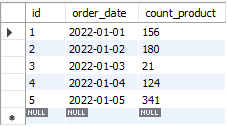
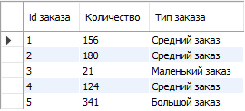
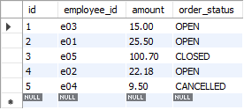
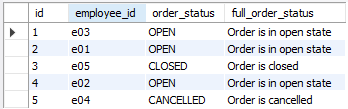
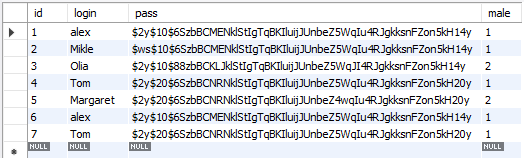
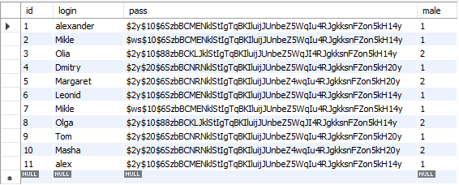
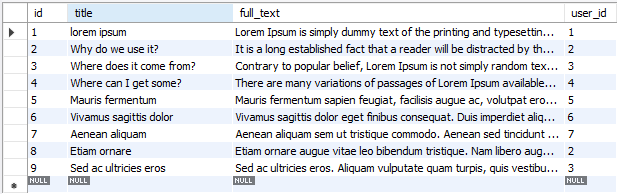
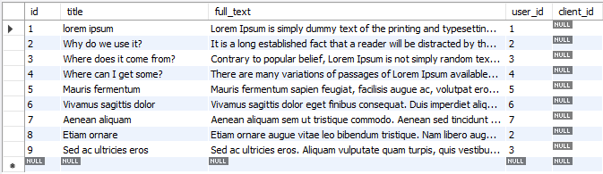
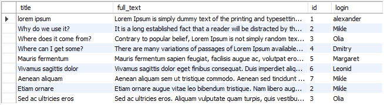
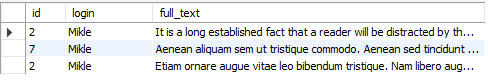

# Урок 2. SQL – создание объектов, простые запросы выборки

## 1. Используя операторы языка SQL, создайте таблицу “sales”. Заполните ее данными

---

## 2.  Для данных таблицы “sales” укажите тип заказа в зависимости от кол-ва

**меньше 100  - Маленький заказ**

**от 100 до 300 - Средний заказ**

**больше 300  -  Большой заказ**

---

## 3. Создайте таблицу “orders”, заполните ее значениями

## Выберите все заказы. В зависимости от поля order_status выведите столбец full_order_status:

**OPEN – «Order is in open state»;**

**CLOSED - «Order is closed»;**  

**CANCELLED -  «Order is cancelled».**

---

## Дополнительное задание **

**_Файл со скриптом прикреплен к материалам(interview.sql):_**

## №1. Используя оператор ALTER TABLE, установите внешний ключ в одной из таблиц (clients-posts)

---

## №2. Без оператора JOIN, верните заголовок публикации, текст с описанием, идентификатор клиента, опубликовавшего публикацию и логин данного клиента

---

## №3. Выполните поиск по публикациям, автором которых является клиент "Mikle"

